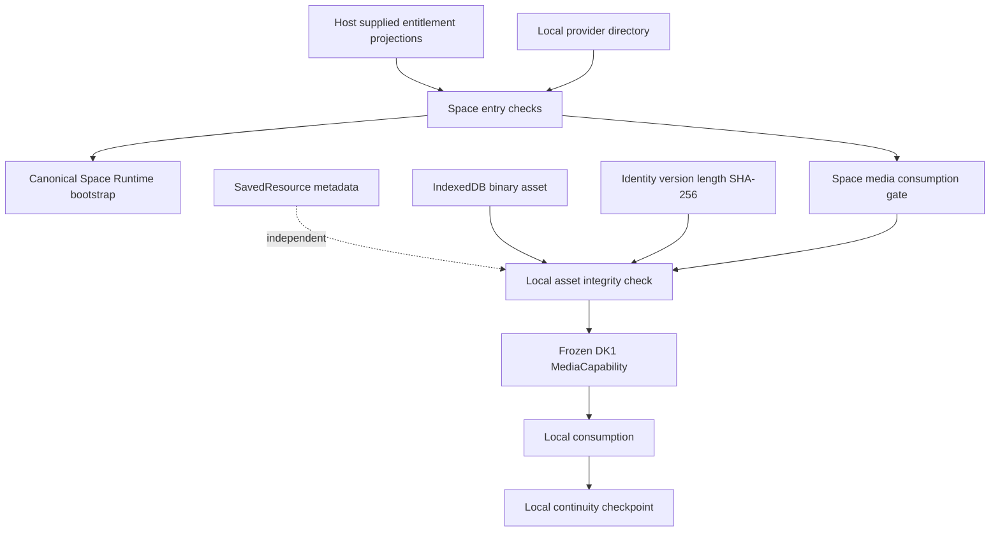
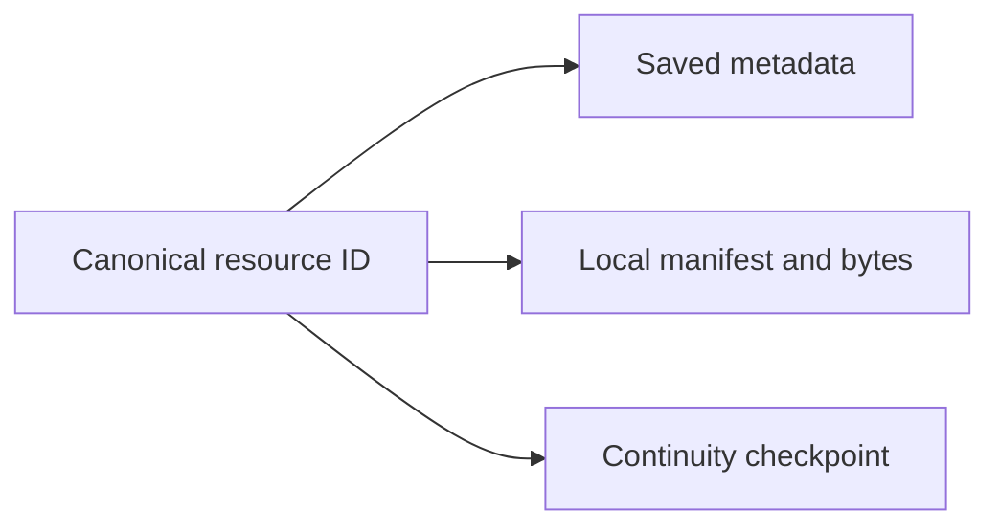
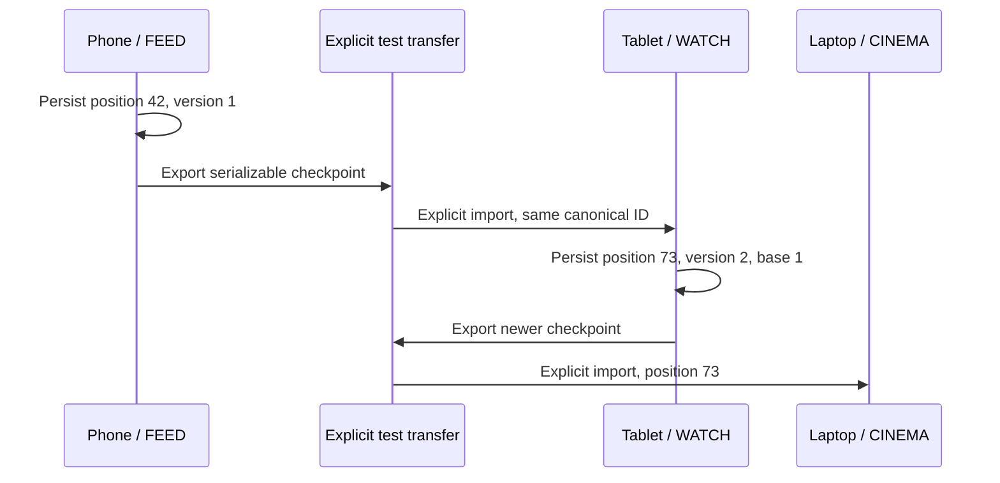

# DUAL-KERNEL DK2 REPORT

DUAL-KERNEL DK2 — SPACE CONSUMPTION FOUNDATION

Verified locally on 2026-09-24. The implementation remains headless. The proof uses generic fixture providers and actual browser IndexedDB; it does not introduce production listings, a new UI, billing, or synchronization.

## Repository state before work

LifeOS and OS SHELL were already dirty. LifeOS contained the verified DK1 work plus existing shell, Space presentation, routes, adapters, tests, manifests, lockfile and build-metadata modifications. OS SHELL contained existing Xperience work and untracked canonical packages. The before-status snapshots are recorded in dual-kernel-dk2-integrity.json.

Existing source work was preserved. The only existing source file extended by DK2 is packages/shared/src/index.ts, with an appended export. Its previous text was compared against a pre-edit copy. The already-modified web tsconfig.tsbuildinfo was restored byte-for-byte from the pre-DK2 snapshot after successful build verification. No reset, stash, commit, push or deployment occurred.

## Canonical abstractions discovered

- DK1: @lifeos/shared kernel-contract, MediaCapability<MediaItem>, ExecutionResult, APP/SPACE and transport vocabulary.
- Canonical Offline Kernel: LastValidStore, VersionedProjection, descriptor and schedule synchronization primitives.
- Canonical Space Runtime: SpaceDefinition, createSpaceRuntime and runtime snapshots.
- Capability Bridge: existing availability/provider registry; no replacement was introduced.
- Space Resolution: existing canonical identity/resolution package; IDs are reused and no alias/identity registry was added.
- LifeOS: product MediaItem, existing online publication read, trust boundary, Space integration, host presentation policy.
- Existing Saved page stores server-backed SavedOfferingPublic; it is not a generic local SavedResource store and was not migrated.
- LocalStorage currently holds preferences and selected local product state. A development fixture uses Cache Storage for media. There was no suitable durable client metadata/checkpoint repository.
- IStorageProvider is the remote Sovereign Drive boundary, not a browser-local database. DK2 does not impersonate it or change its semantics.

## Existing components reused

The shared contract package, frozen DK1 offline capability, existing MediaItem IDs, canonical Space Runtime bootstrap and existing test/build tools are reused. Verified binary data is adapted into the DK1 LastValidStore-shaped projection at read time. Entitlement denials and continuity conflicts use DK1 ExecutionResult rather than a parallel result engine. No dependency or package manifest was changed.



## Files changed

Only this existing source file was extended:

- packages/shared/src/index.ts — append the new contract export (two lines including separator).

Added implementation:

- packages/shared/src/space-consumption.ts
- apps/lifeos-web/src/lib/space-consumption/validation.ts
- apps/lifeos-web/src/lib/space-consumption/database.ts
- apps/lifeos-web/src/lib/space-consumption/directory.ts
- apps/lifeos-web/src/lib/space-consumption/resources.ts
- apps/lifeos-web/src/lib/space-consumption/continuity.ts
- apps/lifeos-web/src/lib/space-consumption/consumption.ts

Added verification:

- apps/lifeos-web/test/dk2-consumption.test.ts
- apps/lifeos-web/test/fixtures/dk2Fixtures.ts
- apps/lifeos-web/test/fixtures/dk2MemoryDatabase.ts (unit-test double only)
- apps/lifeos-web/test/fixtures/dk2-browser-harness.ts
- apps/lifeos-web/scripts/verify-dk2-browser.mjs
- apps/lifeos-web/tsconfig.dk2.json

Added documentation/evidence:

- docs/dual-kernel-dk2.md
- docs/dual-kernel-dk2-browser-results.json
- docs/dual-kernel-dk2-integrity.json

Shared/web dist outputs were regenerated by successful builds. Existing application components, Saved UI, TrustID, TV/Radio, DK1 implementation/tests and frozen packages were not edited.

## Space entitlement model

UserAccessEntitlements separates appAccess and spaceAccess, with a source reference and expiry. These values are supplied by the host, not inferred from saved data, install state, device possession or a provider descriptor. An APP-only session can continue through the existing Online Kernel. Subscriber-only Space entry returns DENIED / SPACE_ACCESS_REQUIRED rather than an authentication redirect. Public consumption can proceed without identity where the provider permits it.

## Business/provider entitlement model

ProviderEntitlements separately represents appDistribution, spacePublish, spaceDistribution and spaceDiscovery, bound to product/provider/source references and expiry. Publishing permission is not automatically distribution permission. Existing distributed content can remain consumable independently of permission to publish new content. Discovery requires its own permission, actual Space distribution and PUBLIC visibility.

The model supports APP-only, private/unlisted/public Space and future Space-only distribution. Basic access, earnings, Studio tooling and TV/Radio channel distribution remain separate commercial dimensions. No prices, billing, product-ownership shortcuts or commercial UI were added.

## Space Provider contract

SpaceProvider references canonical spaceId, productId, providerId and publisherRef, plus generic display/search metadata, PUBLIC/UNLISTED/PRIVATE/RELATIONSHIP_ONLY visibility, capability/experience lists, descriptor/schema versions, validity, distribution-source reference and optional integrity reference. Its optional versioned bootstrap represents locally held descriptor/runtime state, not local media availability or executable package installation. An integrity reference is metadata, not an assertion of verified signature or authority.

The descriptor does not mint a second identity or grant access. Distribution projections are supplied separately. Media availability is independently evidenced by LocalAssetManifest and actual binary content.

## Space Directory implementation

SpaceDirectory persists supplied descriptors, searches generic metadata and resolves exact canonical Space IDs. It is a deterministic local directory projection, not a global search engine or a replacement identity resolver. Malformed/stale descriptors are excluded. Normal search excludes unlisted, private, relationship-only, APP-only and non-discovery-entitled products. An unlisted or non-discovery product can still be entered by exact ID if distribution and user policy permit.

Entry follows descriptor resolution, distribution check, user access check, visibility policy and local bootstrap validation. PRIVATE and RELATIONSHIP_ONLY always fail closed in DK2; no ad hoc relationship authorization is implemented. Canonical createSpaceRuntime supplies the returned runtime state. APP entry results describe a locally evaluated commercial gate, not a remotely completed API read.

## SavedResource model

SavedResource is a discriminated wrapper with one canonical resourceId, resourceType, session/profile scope, provider/product/Space references, timestamps, sync state and availability reference. MEDIA reuses product MediaItem metadata. Non-media resource types use reference metadata without playback fields. Scope keys are serialized tuples to avoid key collisions. Invalid rows are counted/rejected individually, leaving valid records readable.

## SavedMedia implementation

MEDIA keeps the canonical MediaItem.id as resourceId, along with its existing kind/title/artwork fields, optional duration/artwork reference, save/access timestamps and independent availability reference. Playback position and last playback update belong to ContinuityCheckpoint rather than duplicated Saved fields. No new media identity or rights model is created. The existing SavedOffering UI and TV/Radio state remain unchanged.



Saving metadata never fetches or stores playable bytes. A local unsaved resource is valid and separately tested. Local writes cannot claim SYNCED; that contract state is reserved for a future verified synchronization path. Explicit checkpoint imports are marked IMPORTED, not globally synchronized.

## Local availability model

NOT_PRESENT, PARTIAL, AVAILABLE_LOCAL, CORRUPT and STALE are computed from current local evidence. No stored downloaded flag is trusted. Media is checked against canonical identity, resource scope, version, byte length and SHA-256. Missing bytes fail even if a manifest exists. Truncated bytes are PARTIAL; changed bytes, mismatched identity or version are CORRUPT. Expired manifests are STALE.

AVAILABLE_LOCAL is returned only after verified bytes are present. Verified bytes are materialized as a data URL for the frozen DK1 adapter; base64 is not used as large localStorage persistence. Corruption returns FAILED. Missing/partial/stale content returns AWAITING_ROUTE with NO_ROUTE or ONLINE_REQUIRED with an available route. Neither case automatically fetches.

## Persistence implementation

Native IndexedDB database lifeos-space-consumption-v1, schema version 1:

| Object store | Durable contents |
| --- | --- |
| providers | Generic versioned descriptors and local bootstrap metadata |
| saved | Scoped SavedResource records |
| availability | Identity/version/length/SHA-256/MIME/time manifests |
| assets | ArrayBuffer media bytes plus product metadata and version |
| continuity | Scoped typed checkpoints |

Binary and manifest writes use one transaction. Structured-clone failures abort the entire write. Checkpoint arbitration runs inside a single read/write transaction. The browser proof verifies atomic rollback and concurrent checkpoint conflict handling. IndexedDB connection/storage failures become truthful failures at the domain APIs. No SQL database, large-media localStorage, cloud storage replacement or automatic background service was introduced.

## Continuity model

ContinuityCheckpoint is scoped by existing subject/session reference, product, provider, Space and canonical resource. It carries experience, device source, schema/data versions, timestamp, sync status and reconciliation metadata. MEDIA has playbackSeconds; other supported resources have a cursor. It is serializable and contains no presentation-specific content ID.

Deterministic policy: an absent checkpoint accepts a valid positive version; an identical checkpoint is idempotent; replacement requires a strictly newer version whose declared baseVersion equals the stored version. Divergent equal versions, stale versions and mismatched bases return CONFLICT without replacing good state. Wall-clock timestamp alone never selects a winner. Corrupt retained checkpoints fail safely rather than being silently overwritten. Transfer imports must match the complete resource/session scope.



This is a continuity contract and local arbitration policy, not a production reconciliation engine or DataZone/PDI synchronization implementation.

## Local NO_ROUTE proof

The Chromium harness persisted a valid 80-second PCM WAV under content:test-media-001, played it and saved position 42. Chromium was fully shut down and reopened with the same persistent profile. After loading the test harness, actual browser networking was disabled. Saved metadata, provider state, binary integrity and checkpoint restoration all passed. The WAV decoded and played at position 42 while offline. Database/runtime handles were also closed and reopened while offline. fetch and XMLHttpRequest instrumentation recorded zero calls. Unsynchronized media returned AWAITING_ROUTE; deliberately corrupted persisted bytes returned FAILED.

## Cross-device simulation proof

PHONE/FEED exports position 42; an independent TABLET store explicitly imports it, retaining the canonical resource ID. TABLET/WATCH writes version 2 at position 73; an independent LAPTOP store imports 73. Tests also cover CINEMA and TV checkpoint contexts. Browser tests use separate IndexedDB databases as simulated devices, not real distributed devices or implicit networking. Concurrent same-base updates produce exactly one local completion and one conflict.

## Non-media business discovery proof

Generic fixtures include a public creator, public Harbour Hotel, unlisted store, private business, APP-only business, no-discovery product and relationship-only product. Searching hotel returns Harbour Hotel. Resolution and entry produce the canonical Space Runtime bootstrap for space:hotel. No booking, payment or media-brand assumptions are involved.

## User entitlement proof

APP-only User A passes the APP gate and reads through the existing Online Kernel but receives SPACE_ACCESS_REQUIRED for subscriber-only Space. User B can enter an eligible Space and still use APP. Public consumption does not synthesize identity. Missing/expired access projections fail closed where entitlement is required.

## Business entitlement proof

APP-only Business A remains valid for APP but is absent from public Space search and denied distributed Space entry. Public Space-enabled Business B is discoverable and enterable. Unlisted/no-discovery providers remain separately consumable by ID where entitled. Tests also prove that APP distribution and new-publication permission do not implicitly determine existing Space distribution.

## Security/authority proof

Entry returns consumptionOnly and runtime state, never owner/admin/financial authority or TrustID claims. Existing TrustID and high-risk authorization remain untouched. Saved rows, binary files, provider metadata and local checkpoints do not grant administrative capabilities. Entitlement projections are explicitly injected host inputs; fixtures do not establish production commercial authority. Checksums detect integrity changes against a retained manifest, not malicious rewriting of both data and manifest or publisher authenticity. Browser-local state remains outside the identity/security authority boundary.

## Frozen-package integrity

dual-kernel-dk2-integrity.json records SHA-256 before/after for 39 files: 10 DK1 implementation/test/config files plus all 29 files across Space Runtime, Offline Kernel, Capability Bridge and Space Resolution. All are unchanged; package path sets were also compared to detect additions/deletions. The shared barrel was separately verified to preserve its previous contents with only the appended DK2 export.

On successful verification, the following semantics are frozen: user Space entitlement separation, provider distribution separation, Saved versus Downloaded, evidence-based local availability and typed/versioned continuity. IndexedDB layout, adapter implementation details and future sync plumbing are not declared permanently frozen.

## Tests run

From LifeOS:

```powershell
npm run build -w @lifeos/shared
npx tsc -p apps/lifeos-web/tsconfig.dk2.json --noEmit
npm test -w @lifeos/web
npm run build -w @lifeos/web
npm run typecheck -w @lifeos/api
git diff --check
```

From apps/lifeos-web (uses already installed OS SHELL verification tooling without changing its packages):

```powershell
$env:DK2_PLAYWRIGHT_MODULE = 'C:\Users\Hp\Desktop\OS SHELL\node_modules\playwright'
node scripts/verify-dk2-browser.mjs
```

If Playwright is installed in the consuming environment, the override is unnecessary. The driver starts its own temporary loopback Vite server and Chromium profile, performs a complete browser restart, and closes the browser/server afterward.

From OS SHELL:

```powershell
node --import tsx --test packages/offline-kernel/test/*.test.ts packages/space-runtime/test/*.test.ts packages/space-capability-bridge/test/*.test.ts packages/space-resolution/test/*.test.ts
```

## Exact test results

| Check | Result |
| --- | --- |
| New DK2 tests | 23/23 passed |
| Frozen DK1 tests | 25/25 passed |
| Full LifeOS web regression (includes DK1/DK2) | 174/174 passed; 27 files |
| Offline Kernel | 5/5 passed |
| Capability Bridge | 27/27 passed |
| Space Runtime | 1/1 passed |
| Space Resolution | 16/16 passed |
| Combined canonical package tests | 49/49 passed |
| Chromium runtime/durability/recovery checks | 21/21 passed |
| DK2 + DK1 + web source TypeScript | Passed; exit 0 |
| API TypeScript | Passed; exit 0 |
| Shared build | Passed; exit 0 |
| Web TypeScript/Vite/PWA build | Passed; exit 0 |
| Protected hashes | 39/39 unchanged |
| Frozen package path sets | 29/29 unchanged |
| git diff --check | Passed |

The 23 new tests and 25 DK1 tests are included in the full 174-test count. Final runs had no failed or skipped tests. The browser evidence is recorded separately as 21 checks rather than inflated unit-test counts.

## Browser proof, if performed

Performed with real headless Chromium, real IndexedDB, actual PCM audio decoding/playback, a persistent profile and complete Chromium restart. The proof is headless runtime validation with a development-only fixture harness, not UI adoption. Harness code was loaded from localhost before browser networking was disabled. It does not claim offline installation or cached loading of the production app shell. Machine-readable results are in dual-kernel-dk2-browser-results.json.

## Environment blockers

None for DK2. Non-failing Node localStorage warnings and Git line-ending notices occurred. No external PostgreSQL service was required; database-backed API integration suites and live deployment checks were not run. No dependency install was needed.

## Git diff summary

DK2 adds 16 implementation/test/config/documentation/evidence files and appends two lines to the existing shared barrel relative to the captured DK1 working tree. Generated dist outputs were refreshed. Pre-existing tracked TypeScript build metadata was restored. Whole-repository Git diffs still include unrelated pre-existing user work; those are not DK2 changes. No frozen sources, application UI, package manifests or lockfiles were changed.

## Known limitations

- Headless foundation only; existing Saved UI and navigation are not migrated.
- Durable browser storage is origin/profile-local and subject to normal browser clearing/eviction; no cross-device durability is implied.
- Media is explicitly preloaded from caller-supplied bytes. Materializing a data URL suits the proof; large-media streaming and cache eviction policy are future work.
- Domain metadata and entitlement sources use explicit fixtures/host projections, not production Directory or billing integration.
- PRIVATE and RELATIONSHIP_ONLY consumption remain denied until a canonical authorization integration exists.
- No signature verification, DRM, cloud synchronization, background downloads or production DataZone/PDI transport.
- SavedOffering, TV/Radio, commerce, messaging, payments and identity behavior remain unchanged.
- Corrupt checkpoints are rejected; no automatic repair or conflict-merging engine is present. Explicit re-preloading can replace damaged media; it never happens automatically.

## Recommended DK3 boundary

Add an explicit, authority-checked synchronization port using the canonical DataZone/PDI/Directory boundaries: verified projection provenance, manifest/byte acquisition, and checkpoint transfer acknowledgments. Retain local-versus-synced and queued-versus-completed distinctions. Treat offline entitlement freshness/revocation policy and storage eviction as explicit design work. Migrate one existing consumer surface only after those boundaries are verified. Keep payments, calls, TV/Radio continuity and commercial UX outside that slice.

DUAL-KERNEL DK2 — VERIFIED
